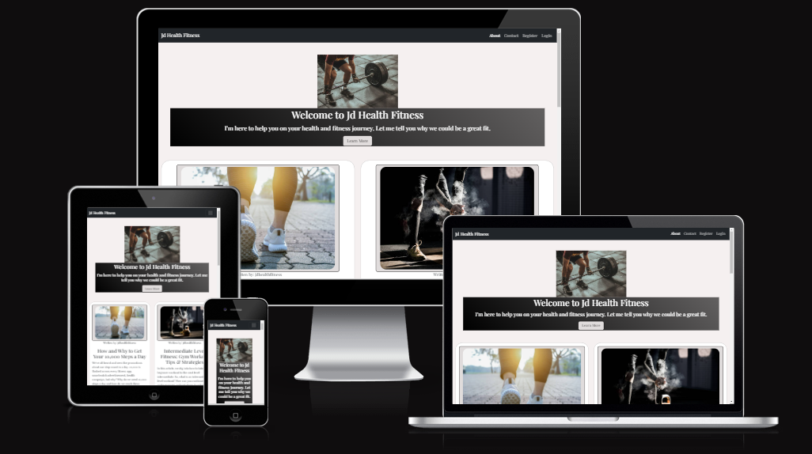
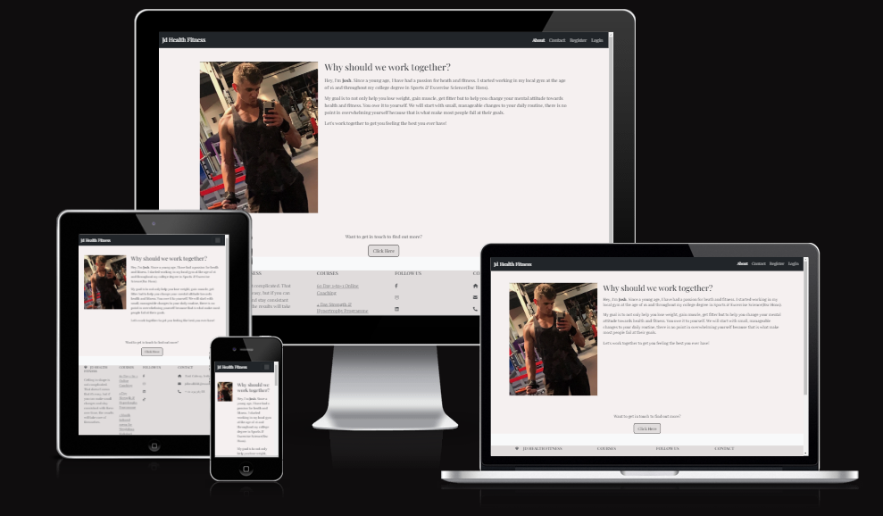
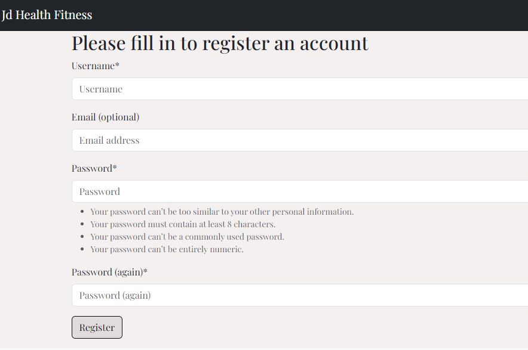
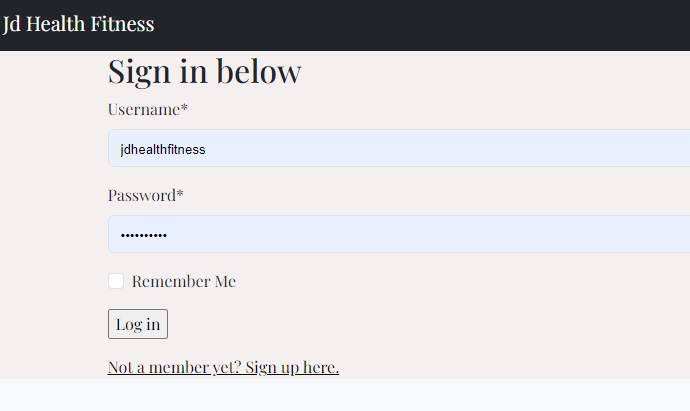
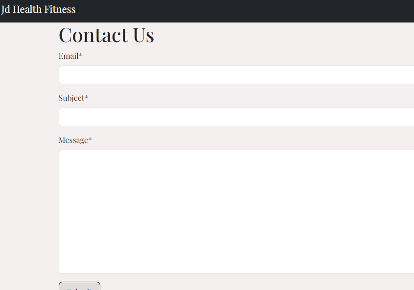

# JD Fitness

JD Health Fitness is a fitness blog site, which offers great advise and support to those who are interested in keeping fit and healthy, or to those looking to change their lifestyle and don’t know where to start.



[Click here to view the live site]( https://jd-fitness-blog-a23552dd7129.herokuapp.com/)

## Table of Contents

1. [Agile Methodology](#agile-methodology)

2. [CRUD Functionality](#crud-functionality)

3. [User Experience(UX)](#user-experience)

4. [Strategy / Site Goals](#strategy—site-goals)

    * [Scope / User Stories](#scope-user-stories)

    * [Structure / Design](#structure-design)

    * [Skeleton / Wireframes](#skeleton-wireframes)

    * [Surface](#surface)

5. [Features](#features)

    * [Current Features](#current-features)

    * [Future Features](#future-features)

6. [Technologies Used](#technologies-used)

7. [Testing](#testing)

8. [Bugs](#bugs)

9. [Deployment](#deployment)

    * [Cloning](#cloning-the-repository)

    * [Forking](#forking-the-repository)

10. [Credits](#credits)


## Agile Methodology

Using the Agile Methodology, I was able to plan and manage this project by breaking up the tasks into smaller, more manageable phases, which keeps the project focused and constantly progressing forward.

I used Github Issues to document user stories [see here](#https://github.com/users/RdeSwart/projects/3/views/1), where each user story contained an Acceptance criteria and the tasks detailed in order to fulfil that criteria.

To give prioritization, I used the [MoSCoW Method](#link-it-here). The acronym MoSCoW represents four categories of initiatives: must-have, should-have, could-have, and won't-have, or will not have right now. MORE ON THIS WHEN THEY WRITTEN!!


Here is the Kanban Board I used to keep everything in order 


Review of agile method:

This was my first time using the agile method on my own project. As someone with ADHD, I found this such a great help to get my thoughts organised. It helped me manage my time better and prioritizing tasks, without getting distracted by the “look” or design was invaluable.

[Back to Top](#back-to-top)

## CRUD Functionality
This site operates with full CRUD (Create, Read, Update and Delete) functionality as outlined below:

* Create: Users can create and account, create a comment and a contact form message.
* Read: Users can read the blog posts in their entirety but clicking on the "Read More" button
* Update: Users can update their comments by editing them, they can update their passwords also using allauth.
* Delete: Users have the option to delete their comments.


## User Experience

### <ins>Strategy / Site Goals:</ins>

As the site owner, the goals for JD Health Fitness is to attract people to the website and generate more clients. The site aims to educate those who have little or no knowledge of the proper practices of fitness or the science behind food health and safety by having Degree-educated personnel writing and running the site.

The target audience for JD Fitness, are people trying to lose weight, gain more muscle, become fitter and more healthy in mind and body.

### <ins>Scope / User Stories:</ins>

#### As a visitor:

* I want to browse blog posts at a glance to learn more about health and fitness.

* I want to be able to open a single blog post to read more about it.

* I want to be able to register for an account.


#### As a registered user:


* I want to be able to login to my account.

* I want to be able to comment on a blog post.

* I want to be able to peruse through fitness/health courses on offer.

* I want to be able to purchase a course securely.

* I want to be able to have access to my purchased courses.

* I want to receive email notifications/newsletter about new blog posts, courses or any promotions.

* I want to be able to log out successfully and get notified about it.


* I want to be able to personalise my profile


#### As an administrator/owner:

* I want to be able to write, edit, draft and publish blog posts and promotions

* I want to be able to add, edit and delete fitness courses.

* I want to manage user accounts and moderate public comments to keep the site safe.

* I would like all services to be visible on the landing Home page.

#### As a developer:

* ????

### <ins>Structure / Design</ins>

It was very important for the site to be responsive on most, if not all screen sizes, as JD Fitness wants the site to be available to users even when “on the go”. It is available on screens from 320px to 2560px sizes. This was made possible by using Bootstrap

The navigation and Footer elements of the site are the same on every page to give a more uniform look.

#### Home Page

Going for a modern, sleek design to show the vibe of the company, which takes on a young, vibrant and modern approach to health and fitness. The owner wanted a very simple and sleek design and decided that greys and whites worked best for their aesthetic.

#### About Page

Continuing the theme throughout the website, the About page features the staff at JD Fitness Health and their credentials.


#### Registration Page

Using Crispy Forms and Allauth, site users can register for their own account in order to react to or comment on a blog post

#### Login Page

Using Crispy Forms and Allauth, registered users can log in to their account on this page.


#### Contact Page

Again using Crispy Forms, any site user, whether registered or not can avail of the contact form and send a message to the site admin/owner.

A success message will display.
ADD SCREENSHOT HERE!!!!!!!!!!!!!!!
## Skeleton / Wireframes

Balsamiq link images here

## Surface Plane

* Colour Scheme:

JD Fitness wanted to give a modern, energetic feel to the website.

The main colours used are: rgb(245, 240, 240)

* Typography:

Google fonts: I used Google Font for the website, deciding that "Playfair Display" best suited the site aesthetic, with a fall back on serif, should the font not load.

Font Awesome: social media icons

[Back to Top](#back-to-top)


## Features

### <ins>Current Features</ins>

#### <ins>Data Models: Blog App</ins>
##### User Model
As part of the Django inbuilt AllAuth library, this model holds information about the user.
##### BlogPost Model
The BlogPost model object represents the individual blog posts created by the superuser. It consists of the following fields:
* blog_author: ForeignKey(User)
* title: CharField
* slug: SlugField
* content: TextField
* excerpt: TextField
* created_on: DateTimeField
* status: IntegerField
* categories: ManyToManyField
##### Category Model
The Category Model object represents the blog posts being organised into different categories for better UX. It consists of the following fields:
* name: Charfield
##### Comments Model
The Comment Model object allows users to comment on blog posts. It consists of the following fields:
* post: ForeignKey
* author: ForeignKey
* body: TextField
* created_on: DateTimeField

#### <ins>Data Models: Contact App</ins>
The Contact Model object allows users to send a message to the amin/superuser.It consists of the following fields:
* email: EmailField
* subject: CharField
* message: TextField

#### <ins>Data Models: About App</ins>
The About Model object renders an About the Owner page to give more information to the user about the credentials of the site owner and the advise he gives.It consists of the following fields:
* title: CharField
* content: TextField

Different pages and their features….

404,403,500 pages… styles are consistent with the site(and also responsive)

<summary>Click to view screenshots</summary>

[Back to Top](#back-to-top)

### <ins>Future Features</ins>

Stripe payments etc

[Back to Top](#back-to-top)

## Technologies Used

### <ins>Languages</ins>

* HTML5

* CSS3

* Python

### <ins>Libraries & Frameworks</ins>

* Django 3.2.18

* Gunicorn 20.1.0

* PostgreSQL type

* Psycopg2 type

* Cloudinary

* Heroku

* ElephantSQL?

* Django AllAuth

* Bootstrap

* Crispy Forms

Google fonts, font awesome, balsamiq, am I responsive, gitpod, github, python linter w3c css validation etc

[Back to Top](#back-to-top)

## Testing

Please see [here](#testing.md) for info on testing

### <int>Bugs</int>

Bug encountered: About Page not rendering database content

Bug Fix: Change .all() to .first() 

ie.about = About.objects.first()
This was because my template was only assuming a single object (about.title and about.content)

Any unfixed Bugs:

[Back to Top](#back-to-top)

## Deployment

<ins>Steps to deploy to Heroku</ins>

Heroku is a container-based cloud Platform as a Service (PaaS). I used it to host JD Health & Fitness. I deployed to Heroku early so that I could continuely test and access the site's features, responsiveness and database access. The steps needed to deploy are:
1. Use ```pip freeze -> requirements.txt``` command to save any libraries that need to be installed in the file.
2. postgres...


### Cloning the repository

To Clone the repository:

1. Go to the [Github repostitory](https://github.com/RdeSwart/jd-fitness-blog)

2. Click on the ```<>Code``` button located above the list of files

3. Choose whether you prefer to clone using HTTPS, SSH or GitHub CI.

4. Copy the URL to clipboard

```git@github.com:RdeSwart/fitness```

5. Open Git Bash or Terminal

6. Change the current working directory to where you would like the cloned directory.

7. In the IDE terminal, paste the link

8. Press Enter to create the local clone

### Forking the Repository

To for the repository:

1. Open the [Github repostitory](https://github.com/RdeSwart/jd-fitness-blog)

2. Click on the “Fork” button at the top of the screen

3. On “Create New Fork” page, rename the repository.

4. Click “Create Fork” at the bottom of the form.

## Credits

* Code Institute’s walkthrough project: “I think therefore I blog"
* Scroll-to-top button from [Stack Overflow](https://stackoverflow.com/questions/1144805/scroll-to-the-top-of-the-page-using-javascript)
* [Django Central](https://djangocentral.com/creating-comments-system-with-django/)
for creating the comment section model
* [ByteGrad](https://www.youtube.com/watch?v=a-VSiUtMayM) Tutorial for NavBar Burger
* [Medium.com](https://medium.com/strategio/my-django-blog-project-5ac08d84b0f8) Tutorial on how to add likes to the blog
* [Twilio.com](https://www.twilio.com/en-us/blog/build-contact-form-python-django-twilio-sendgrid) Tutorial on contact form submissions


### Media used

* Logo is from:

* Images from:
* [Aura leisure](https://www.auraleisure.ie/blog/)
for blog post content
* [Imresizer](https://imresizer.com/) to resize the favicon.
* [Flaticon](https://www.flaticon.com/free-icons/gym) for the Gym favicon
* 


[Back to Top](#back-to-top)
